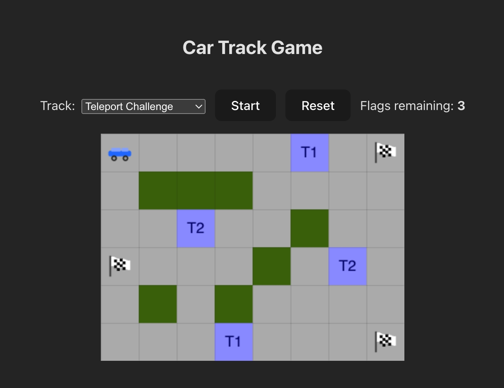

## Car Game

A strategic car racing game where you navigate through challenging grid-based tracks. Collect all flags while avoiding walls, use teleporters to jump across the map, and find the optimal path to victory. Features an intelligent solver that can automatically find the best route through any track.

### Quick start

- **Prerequisites**: Node.js 18+ and npm 9+; Python 3.10+
- **Install dependencies (first time only)**:
  - Root tools: `npm install`
  - Frontend app: `cd frontend && npm install`
- **Start both apps (from repo root)**:
  - `npm run dev`
  - Frontend: `http://localhost:5173`
  - Backend (FastAPI): `http://localhost:8000` (docs at `/docs`)

The first backend run auto‑creates a virtualenv at `backend/.venv` and installs `requirements.txt`.

### Project structure

- `backend/`: FastAPI service
  - `app/main.py`: API routes and CORS
  - `app/algo.py`: solver for grid -> moves
  - `app/tracks.json`: built‑in sample tracks
  - `requirements.txt`: Python deps
- `frontend/`: React + Vite client
  - `src/components/GameCanvas.tsx`: canvas rendering + controls
  - `src/api.ts`: API client (axios)
  - `package.json`: scripts for dev/build/lint

### Scripts

- Root
  - **dev**: runs backend and frontend together via concurrently
- Frontend (`cd frontend`)
  - **dev**: Vite dev server
  - **build**: Type-check then build
  - **preview**: Serve built assets
  - **lint**: ESLint
- Backend
  - Dev server (alternative manual run): `.venv/bin/uvicorn app.main:app --reload --host 0.0.0.0 --port 8000`

### Configuration

- **Frontend -> Backend URL**: `VITE_API_BASE` (defaults to `http://localhost:8000`)
  - Example: `VITE_API_BASE=https://api.example.com` when building/serving the frontend
- **CORS**: backend allows `http://localhost:5173` during development

### API overview (FastAPI)

- `GET /api/tracks` → `{ tracks: Track[] }`
- `POST /api/validate` → `{ valid: boolean, message: string }`
- `POST /api/solve` → `{ moves: string[] }`
- `GET /healthz` → `{ status: "ok" }`

Types (frontend `src/api.ts`):
- **Grid**: `string[][]`
- **Track**: `{ id: string; name: string; grid: Grid }`

### Grid tokens

- **"0"**: road
- **"1"**: wall
- **"S"**: start (exactly one)
- **"F"**: flag/finish (at least one)
- **"T..."**: teleporter pairs (e.g., `T1`, `T2`), each must appear exactly twice

### Production notes

- Frontend build: `cd frontend && npm run build` (outputs to `dist/`)
- Backend: run with Uvicorn or any ASGI server against `app.main:app`
- Set `VITE_API_BASE` to your backend URL before building the frontend
